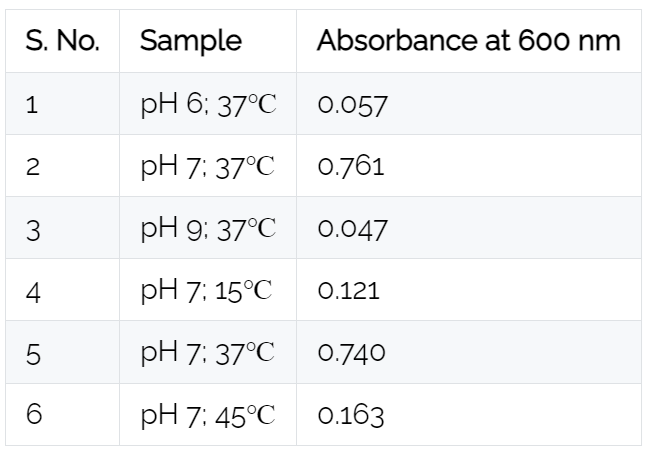

### Procedure

#### Materials required:

* Culture of E. coli
* Nutrient media (LB broth)
* 1 g of tryptone, 0.5 g of yeast extract, 1 g of sodium chloride (NaCl), and Distilled water.
* Incubator
* pH meter/Litmus paper
* Buffer solutions
* Spectrophotometer

#### Preparation of LB broth:

* Add measured amounts of tryptone, yeast extract, and sodium chloride into an autoclavable glassware. 
* Fill it with distilled water up to the 100 ml mark. 
* Ensure all solids are completely dissolved. 
* Leave some headspace to prevent spills during autoclaving. 
* Cover the glassware with aluminium foil or autoclave tape to avoid contamination during sterilization.

#### Autoclave/sterile media:

Autoclave the LB broth at 121°C for 20 minutes at 15 psi to sterilize and ensure the elimination of any microbial contaminants. After autoclaving, allow the LB broth to cool to room temperature before use. Avoid contamination by using sterile equipment and maintaining aseptic techniques.

#### Incubation:

<b> For pH difference: </b>

Adjust the pH of the culture media to 6, 7 and 9; add 1 % of inoculum in the culture tube and incubate all three tubes at 37℃.

<b> For temperature difference: </b>

Add 1 % of inoculum in the culture tubes with media at pH 7 and incubate tubes at 37℃ and 45℃.

#### Analysis of bacterial growth:

Post overnight incubation (12 h to 16 h). Observe the tubes for turbidity (which is equivalent to bacterial growth). Dispense 300 µl of culture per well in 96 Elisa plates. Record the absorbance at 600 nm in a spectrophotometer and observe the absorbance value.

#### Results:

 

#### Conclusion:

High absorbance, i.e., highest bacterial growth, is observed in samples with pH7 and 37℃.
At pH 6 and 9, no growth is observed.
At pH 7; 45℃, no growth is observed.
Therefore, both pH and temperature play a vital role in the growth of bacteria. The optimum pH and temperature for the growth of E. coli is 7 and 37℃ respectively.

  

  <figure class="video_container" style="width: 600px; height: 350px;">
    <iframe style="width: 100%; height: 100%;" src="https://www.youtube.com/embed/videoseries?si=hoJDMyt4MrB90Ewm&amp;list=PLTkVi3dAX_-9i27_yl-oBbJQWL_usomcz" title="YouTube video player" frameborder="0" allow="accelerometer; autoplay; clipboard-write; encrypted-media; gyroscope; picture-in-picture; web-share" referrerpolicy="strict-origin-when-cross-origin" allowfullscreen></iframe>
  </figure>

