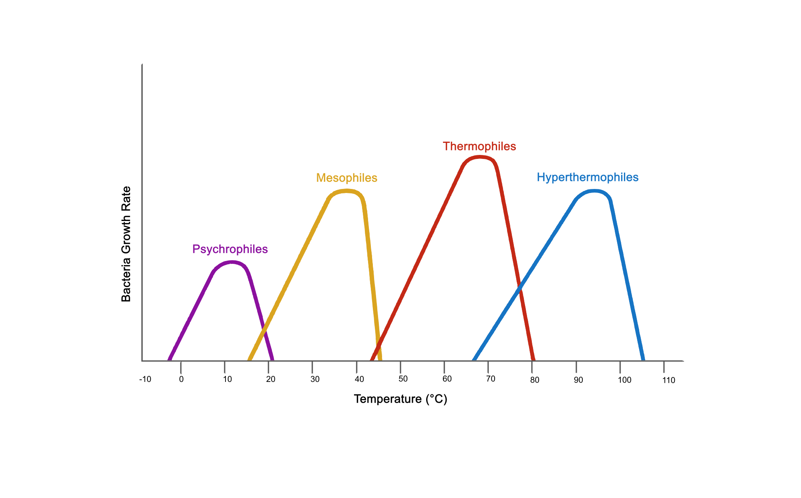
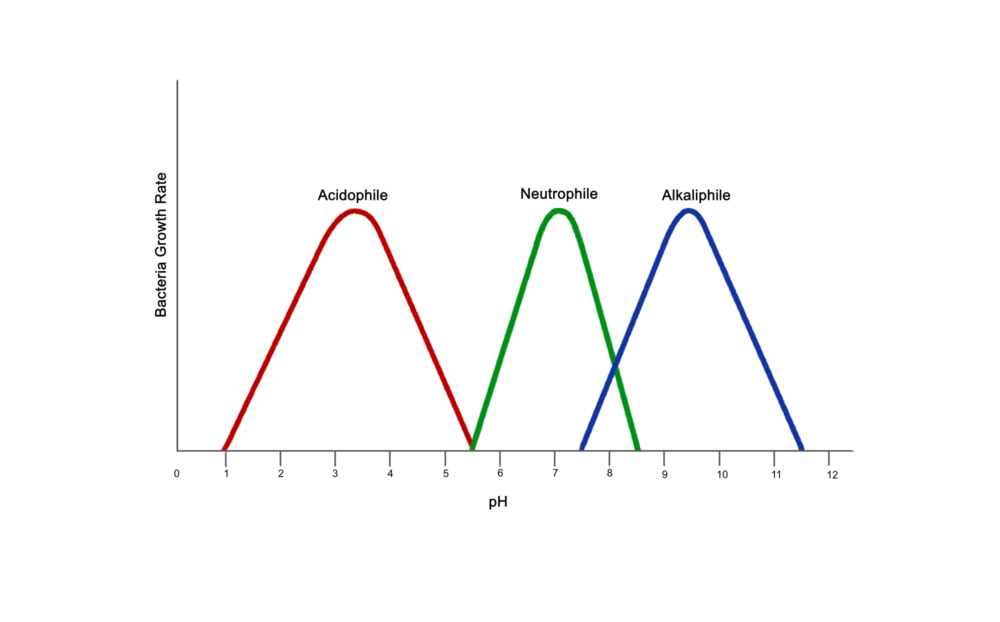

### Theory

Different microorganisms (microbes) require various factors to develop and endure. These elements are physical or chemical characteristics that specify the microbe's habitat. An organism is considered obligatory because some aspects have stringent requirements for those elements to thrive. Additionally, certain microbes may be facultative for particular characteristics, meaning they may live in environments with or without them. Numerous environmental elements have an impact on microbial development. The five physical variables that are most crucial are pH, temperature, oxygen, pressure, and salinity.

#### Temperature
Temperature plays a vital role in the growth and development of microorganisms. According to the range of temperatures at which they can thrive, microbes may be generally categorized. At optimum growth temperature, the growth of microorganisms is highest. Its minimal growth temperature is the lowest temperature at which the organism can endure and reproduce. Its maximal growth temperature is the temperature at which growth is possible. The acceptable growth temperature ranges below are estimates and may change depending on other environmental conditions. Microorganisms that grow at lower temperatures are called psychrophiles. Generally, they are found in arctic and Antarctic ice packs. They contain a high level of unsaturated fatty acids that help them to remain fluid at low temperatures. Mesophiles are those microorganisms that grow at 20 to 40 °C temperature (e.g., E. coli, Salmonella spp., and Lactobacillus spp.). Microorganisms that grow between 40-65°C are called thermophiles (e.g., lactobacilli, Streptococcus thermophilus, and bifidobacterial). Extreme thermophiles are microorganisms that grow above 65 °C. Generally, they are found in water heaters, hot springs, and vents. Examples are Pyrodictum and Thermus aquaticus.

 

#### PH
Microbes can survive, develop, and reproduce in a limited range of physical environments. One of the factors influencing the development of microorganisms is pH. Because pH modifies many biomolecules' ionic charges and the capacity of enzymes to catalyse reactions, it makes bacteria more vulnerable to metabolic processes. The bacteria are categorized as Acidophiles, which love high H+ ions concentration and thrive below pH 5.5, based on the favorable H+ ions concentration difference. Alkalophiles or basophils thrive in an alkaline environment and grow above a pH of 8.5. Neutrophils typically grow in the neutral pH range, or between 5.5 and 8.5 pH. Since our bodies' pH ranges in the same range as theirs, neutrophils are mainly harmful to us.

 

#### Oxygen
The capacity of microorganisms to flourish in any environment can depend critically on the presence or absence of molecular oxygen. Injurious superoxide and peroxides are created when bacteria use oxygen for cellular respiration and other chemical processes. If these highly reactive metabolites are not rapidly eliminated, they harm the cell. Aerobic energy generation (cellular respiration), which uses oxygen as the last link in the electron transport chain, is how bacteria known as aerobes create ATP. Aerobes generate enzymes that break down hazardous forms of oxygen and its intermediate metabolites, such as catalase, peroxidase, and superoxide dismutase.

We can differentiate the microorganism based on the availability of oxygen.

* Aerobe: - microorganism that can only exist and reproduce when there is free oxygen (e.g., certain bacteria and specific yeasts).

* Facultative anaerobes: - If there is oxygen present, facultative anaerobes can alter their metabolic activities to use respiration, which is more efficient, and less efficient fermentation when there is no oxygen. (e.g., Escherichia coli, Salmonella, and Listeria spp.,).

* Obligate Anaerobes: - these Microorganisms do not require oxygen for their growth. (e.g., Actinomyces, Bacteroides, Clostridium, Fusobacterium, and Peptostreptococcus).

#### Pressure
Most microorganisms on land or at sea are continually exposed to a pressure of 1 atm. Bacteria survive and adapt despite these extremes. Some bacteria in the guts of deep-sea crustaceans, such as amphipods and holothurians, are barophilic and grow faster at high pressure (e.g., Phytobacteria, Shewanella, Colwellia). In deep water, hydrostatic pressure can reach 600 to 1100 atm, with temperatures ranging from 2°C to 3°C. Many organisms can survive and adapt to these harsh circumstances, and many are barotolerant; higher pressure harms them but not as much as it harms nontolerant bacteria. These bacteria may be crucial in nutrient recycling in the deep oceans. Protein and unsaturated fatty acids (PUFA) are found in lipids.

#### Salinity
Some species are obligatory halophiles, meaning they require salt to thrive and will lyse or break open if the salt level falls too low. Other halophilic creatures are halotolerant, meaning they do not require salt to thrive but can withstand moderately salty surroundings. Halophiles are part of a broader category known as extremophiles, which live in severe circumstances due to cellular, protein, and cell membrane adaption. Slight halophiles thrive in surroundings with 1 to 6% salt. Halophiles with moderate salt tolerance, like 6 to 15% salt. Extreme halophiles like salty surroundings contain 15 to 30 percent salt. Scientists use these categories to create culture media ideal for the organisms they want to cultivate. Halotolerant organisms prefer salt-free environments but can survive at slight or moderate salt levels. Halotolerant organisms prefer salt-free habitats but may thrive in mild to moderate salinity. (e.g., Halobacterium salinarum, Halococcus salifodinae, and  Debaryomyces hansenii )